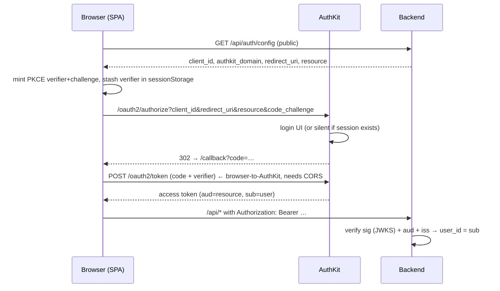
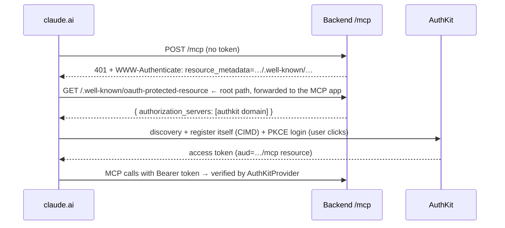

# How auth works — and how it breaks

The mental model, the moving parts, and a field guide mapping each failure symptom to
what it means. Written after debugging the real thing; every failure mode listed at the
bottom actually happened on 2026-07-29.

## The one-paragraph model

WorkOS AuthKit is the **authorization server** (`https://friendly-canyon-24.authkit.app`):
it owns login screens, passwords, and token minting. Our backend is a **resource
server**: it never sees a password and holds no session state — it just verifies, on
every request, that a JWT was (1) signed by AuthKit, (2) minted *for us*, and (3) not
expired, then trusts the `sub` claim inside as the user id. Both front doors — the SPA
and the Claude connector — end at the same verification and the same service layer.
Everything else is plumbing to get a valid token into the request.

## The cast

| Piece | Where | Role |
|---|---|---|
| AuthKit environment "Production" | WorkOS project **Swolemates** | The authorization server. Issues every token. |
| Connect app **"Swolemates Web"** (`client_01KYR2Q17J…`) | WorkOS | The SPA's OAuth client. Public (PKCE, no secret). Owns the browser redirect URIs. |
| Claude's client | WorkOS, self-registered | Created automatically via CIMD/DCR when someone adds the connector. We never configure it by hand. |
| Resource indicators | WorkOS | The allow-list of audiences AuthKit will mint tokens *for*: our origin (± `/`) and `…/mcp`. |
| JWT template | WorkOS | Adds `email`, `first_name`, `last_name` claims to access tokens. |
| `AuthKitProvider` | `backend/app/mcp/server.py` | Verifies tokens on the `/mcp` door; also serves the OAuth discovery metadata that tells Claude where to log in. |
| `require_principal` | `backend/app/auth.py` | Verifies tokens on the `/api` door. Same checks, same JWKS. |
| `frontend/src/auth/` | SPA | Runs the browser's OAuth dance and holds the token in sessionStorage. |

Two doors, two verifiers, one issuer, one `sub` — and the service layer only ever sees
the `sub`.

## Flow 1: the browser (authorization code + PKCE)

Details that matter:

- **PKCE is the security**, not a secret: the token exchange only works from the tab
  that started the login, because only it holds the verifier. That's why continuing a
  login in a *different tab* (email-verification links do this) can't finish — the app
  detects the missing verifier and silently restarts the login instead.
- **The token POST is a cross-origin browser call.** AuthKit only attaches CORS headers
  for origins configured as *web origins* in WorkOS. Miss that and the failure is
  invisible to the server — only the browser's network tab shows it.
- **`resource` decides the audience.** The SPA asks for `resource=<PUBLIC_URL>` at
  authorize time; AuthKit stamps it as the token's `aud`; our backend refuses any other
  audience. This is what makes a token stolen from some other WorkOS-backed app useless
  against us. (Sent on the authorize leg only — WorkOS returns `invalid_target` if the
  token leg repeats it.)
- Token lives in **sessionStorage**: gone when the tab closes, never readable
  cross-origin, and any 401 clears it and drops the app back to signed-out.

## Flow 2: the Claude connector (CIMD + the same OAuth underneath)

The connector flow is *self-configuring*: Claude discovers everything from that first
401. Which means the discovery chain itself is load-bearing — if any link serves the
wrong thing (see failure #1 below), setup dies before a login screen ever appears.

## Where the trust boundaries are

1. **AuthKit ↔ us: asymmetric keys.** We fetch AuthKit's public keys from
   `/oauth2/jwks` and verify RS256 signatures. AuthKit never needs to know any secret
   of ours; we never see a password. Key rotation is handled by `kid` lookup.
2. **`aud` is the blast-radius limiter.** Signature proves *AuthKit minted it*; audience
   proves *for us*. Both checks live in `verify_bearer_token` (REST) and
   `AuthKitProvider` (MCP). Skipping audience validation is the classic MCP
   vulnerability the design doc warns about.
3. **`sub` is the entire permission model.** After verification, the WorkOS user id is
   stamped on every row and filtered in every service query. There are no roles, no
   sessions, no server-side login state to invalidate.
4. **The dev bypass is environment-gated.** `ENVIRONMENT=local` (and only local) lets
   requests without a token act as `DEV_USER_SUB`. Production refuses to boot
   misconfigured; a test asserts the bypass is inert elsewhere.

## Field guide: symptom → meaning

Every entry below happened for real during setup week.

| Symptom | What it means | Where to look |
|---|---|---|
| Connector setup dies instantly, no login screen | OAuth **discovery chain** broken — Claude couldn't fetch `/.well-known/oauth-protected-resource` at the origin root (e.g. the SPA catch-all swallowed it) | `curl <origin>/.well-known/oauth-protected-resource` — must be JSON, not HTML |
| `error=application_not_found` on the AuthKit page | Wrong **kind** of client ID: the environment client ID was used where a **Connect application** client ID is required (`/oauth2/*` only serves Connect apps) | `WORKOS_CLIENT_ID` must be Swolemates Web's, not the dashboard's environment ID |
| Login page fine, then bounced back to sign-in; `token` request red in devtools; nothing in server logs | **CORS**: AuthKit didn't attach `access-control-allow-origin` to the token response because the origin isn't a configured web origin. The server never saw anything — this failure exists only in the browser | WorkOS web origins (env `updateCorsConfig` via connector); confirm with `curl -H "Origin: …" -X POST …/oauth2/token` |
| Stuck forever on "Signing in…" | A **thrown** (not failed) exchange with no `.catch` — historically the CORS block above | Browser console; fixed by the catch + error surfacing |
| Backend logs `rejected bearer token: Audience doesn't match` | Token minted for a different **audience** — the SPA didn't request our `resource`, or `PUBLIC_URL` disagrees with what was requested | Compare the JWT's `aud` to `PUBLIC_URL`; check the resource indicator list in WorkOS |
| Token exchange returns `{"error":"invalid_target"}` | The **resource parameter** was repeated/unacceptable at the token leg — WorkOS binds resource at authorize only | Send `resource` on the authorize leg only |
| `rejected bearer token: Signature verification failed` | Token from the **wrong issuer** (another AuthKit env, or staging vs production) — its `kid` isn't in our JWKS | `AUTHKIT_DOMAIN` vs the environment that actually issued the token |
| `rejected bearer token: Token has expired` | Normal: access tokens live 5 minutes. The SPA currently makes you sign in again (silent → instant if the AuthKit session is alive). Refresh tokens are future work | Only a bug if it happens *immediately* after login (clock skew) |
| Everything 401s locally | `ENVIRONMENT` isn't `local`, so the dev bypass is off | `backend/.env` (written by `make db`) |
| Production deploy dies at boot with a config error | The **guard working as designed**: missing AuthKit vars or a localhost `PUBLIC_URL` refuse to serve an open MCP endpoint | Railway variables |
| Works in browser, connector fails (or vice versa) | The doors diverge only in verification config — audience expectations (`origin` vs `…/mcp`) or one verifier's domain differs | Compare `AuthKitProvider(base_url=…)` vs `verify_bearer_token`'s audience list |

## The general diagnostic order

Failures earlier in the chain mask everything after them, so always walk forward:

1. `curl <origin>/api/auth/config` — is the server's view of the world right?
2. Browser devtools network tab — did authorize redirect? did `/callback?code=` come
   back? did the token POST succeed, and if red, is it a status code or a CORS block?
3. Browser console — the SPA now logs every exchange failure with the response body.
4. Railway deploy logs — `rejected bearer token: <reason>` is the backend's side of
   the story (via the Railway connector: filter logs for `rejected`).
5. Decode the token (paste into jwt.io or `python -c` with `jwt.decode(...,
   options={"verify_signature": False})`) and read `aud`, `iss`, `exp` yourself.

Rule of thumb: **silent failures are browser-side (CORS, thrown fetches); loud ones are
server-side (our logs name the exact check that failed).** If neither side says
anything, the request never happened — look at the discovery/redirect steps.
