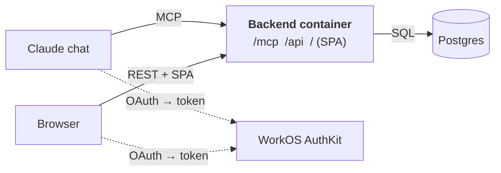
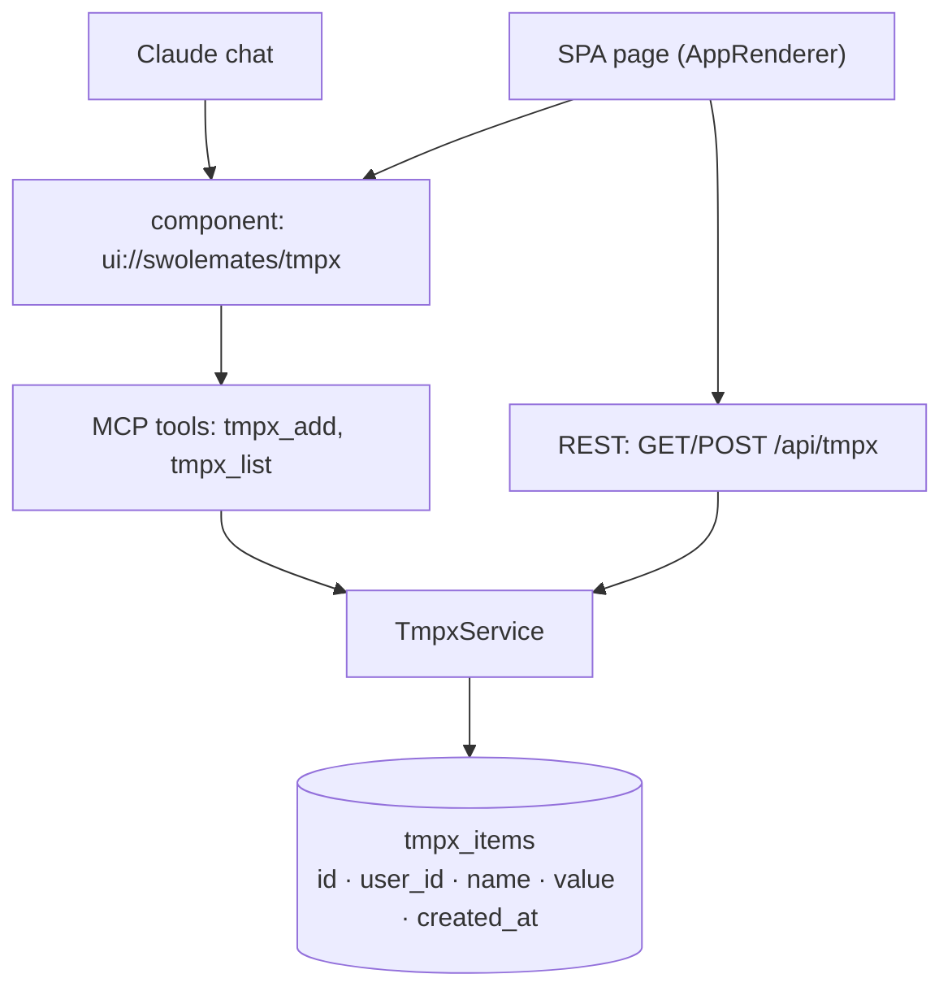
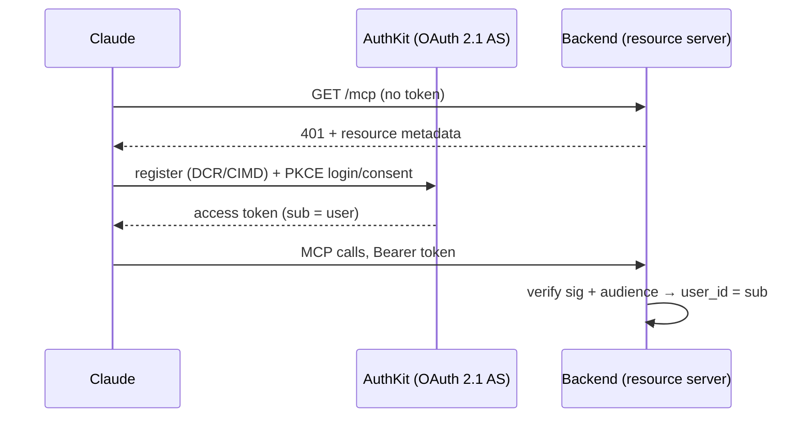
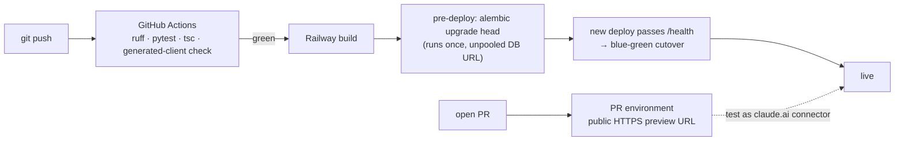

# Swolemates Platform Design

**Proposal · July 2026.** One backend, two front doors: a web app and a Claude connector (remote MCP) sharing the same data and the same interactive components. This doc defines the platform and dev environment, proven by a disposable template slice ("TmpX") that gets copied for real features and then deleted.

**Principles:** one deployable container · boring, swappable standards (Docker, Postgres, OAuth 2.1, MCP spec) · buy auth, never build it · fewest services: GitHub + Railway + WorkOS, ~$5–10/mo.

---

## 1. System



Solid = runtime requests (all carry an AuthKit bearer token); dashed = one-time OAuth flow. Both entry points resolve the user from the token and converge on one service layer — all permissions live there, never per-transport. AuthKit issues tokens; the backend only verifies them.

## 2. Repo

```
swolemates/
├── backend/
│   ├── app/
│   │   ├── main.py        # mounts /api, /mcp, SPA static; /health
│   │   ├── api/           # REST routers
│   │   ├── mcp/           # FastMCP tools + ui:// resources
│   │   ├── services/      # shared logic + authz (the only place permissions live)
│   │   └── models/        # SQLAlchemy — schema source of truth
│   ├── alembic/           # migrations — run once via Railway pre-deploy command
│   ├── pyproject.toml     # uv-managed deps (+ uv.lock)
│   └── tests/
├── frontend/              # Vite React SPA · TanStack Query for /api calls
│   ├── src/api/           # openapi-typescript client generated from FastAPI schema in CI
│   └── src/mcp-apps/      # component bundles (ext-apps) — render in Claude AND SPA
├── Dockerfile             # build SPA → copy into Python image
├── docker-compose.yml     # local Postgres
└── .github/workflows/ci.yml
```

## 3. TmpX — the disposable template slice

One table exposed four ways through one service. Copy for each real feature; delete TmpX when the first lands.



**Done when:** add an item in Claude, see it in the web app (and vice versa); users can't see each other's items; deployed via `git push`.

## 4. Auth



AuthKit meets Claude's requirements (PKCE, DCR + CIMD, hosted login/consent); FastMCP's `AuthKitProvider` handles the backend side. `sub` stamped on every row is the whole permission model for now. Gotchas: DCR clients need `token_endpoint_auth_method: "none"`; OAuth interop is the #1 risk — prove the real claude.ai flow before building features. Same flow for the browser.

## 5. CI/CD



No deploy YAML — Railway builds from the repo, gated on CI ("Wait for CI"). Sleeping stays OFF (cold starts break Claude tool calls). Local dev: compose Postgres + `uvicorn --reload` + `vite dev`; MCP Inspector for tools. Env config: `DATABASE_URL` (injected), `WORKOS_*`, `PUBLIC_URL`.

**Scaling out:** N replicas per service (Hobby allows 6; random, non-sticky load balancing — fine, the app is stateless) × `uvicorn --workers M` per replica. Healthcheck + `overlapSeconds` give zero-downtime blue-green swaps; consequences: migrations run once via pre-deploy and must be backward-compatible (old + new code overlap briefly), and replicas × workers × pool size must fit Postgres connections — enable Railway's one-click PgBouncer when replicas > 1, keep no state in process memory. ([scaling](https://docs.railway.com/reference/scaling) · [pre-deploy](https://docs.railway.com/guides/pre-deploy-command) · [PgBouncer](https://docs.railway.com/databases/postgresql-pgbouncer))

## 6. Key constraints & decisions

- MCP: stateless Streamable HTTP (2026-07-28 spec drops sessions); FastMCP 3.x now, 4 when stable; combine FastMCP's lifespan into FastAPI's; validate token audience.
- Tools are task-shaped, not a REST mirror; every UI tool also returns plain text for non-UI hosts.
- Components: iframes get no external network by default — inline assets; external domains are explicit `_meta.ui.csp` decisions; no widget-state persistence (persist via tool calls).
- Frontend: no SSR; built in CI into the backend image — no separate host. TanStack Query for all `/api` data fetching; API types generated from FastAPI's OpenAPI schema (`openapi-typescript` + `openapi-fetch`) in CI — end-to-end type safety, no tRPC/GraphQL.
- Python tooling: **uv** (lockfile, used in Dockerfile and CI); ruff for lint/format.
- Postgres is plain — swap Railway→Neon later for branch-per-PR DBs, zero code change. Priced exit: same container on Cloud Run ≈ $17–20/mo.

## 7. Costs

| Railway (container + Postgres) | WorkOS (≤1M MAU) | GitHub | **Total** |
|---|---|---|---|
| ~$5–10/mo | $0 | $0 | **~$5–10/mo** |

## 8. Build order

1. **Scaffold** — repo layout above, CI workflow, Railway wired; deploys a bare route.
2. **Auth spike** — AuthKit + protected `whoami` tool; prove the claude.ai OAuth flow (riskiest first).
3. **TmpX slice** — table, service, REST, tools, SPA login.
4. **TmpX component** — renders in Claude and SPA.
5. **Harden + replace** — Inspector smoke test in CI, audience tests; first real feature copies TmpX, then delete it.

---

**Sources:** [Claude connector auth](https://claude.com/docs/connectors/building/authentication) · [MCP Apps (SEP-1865)](https://modelcontextprotocol.io/seps/1865-mcp-apps-interactive-user-interfaces-for-mcp) · [interactive connectors](https://support.claude.com/en/articles/13454812-use-interactive-connectors-in-claude) · [FastMCP FastAPI](https://gofastmcp.com/integrations/fastapi) / [apps](https://gofastmcp.com/apps/overview) / [AuthKit](https://gofastmcp.com/integrations/authkit) · [AuthKit MCP](https://workos.com/docs/authkit/mcp) · [Railway PR envs](https://docs.railway.com/guides/environments) · [ext-apps](https://github.com/modelcontextprotocol/ext-apps) · [mcp-ui client](https://mcpui.dev/guide/client/overview) · [MCP 2026-07-28 RC](https://blog.modelcontextprotocol.io/posts/2026-07-28-release-candidate/)
